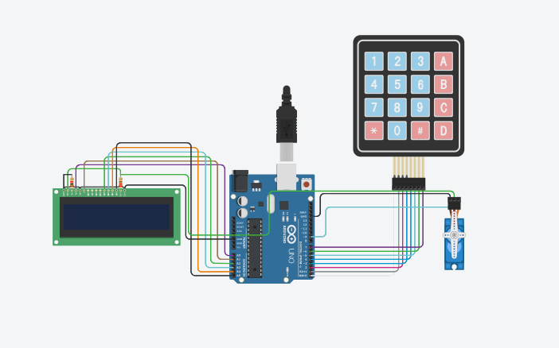

#  🔐 Arduino Password-Based Door Lock System

This project implements a secure door lock mechanism using an Arduino Uno, a 4×4 matrix keypad, a servo motor, and an LCD display. Users must enter a correct 4-digit password to open the door; multiple failed attempts lock the system until reset.

---

##  🛠️ Components Used

- **Arduino Uno**  
- **4×4 Matrix Keypad**  
- **SG90 Servo Motor** (or similar)  
- **16×2 Liquid Crystal Display (LCD)** (e.g., HD44780)  
- **LEDs (optional)** (e.g., green for success, red for failure)  
- **Resistors (220 Ω)**  
- **Breadboard**  
- **Jumper Wires**  
- **USB Cable** for power and serial communication  

---

##  ⚙️ Hardware Connections

1. **Keypad**  
   - Rows → Arduino digital pins: `rowPins = {0, 1, 2, 3}`  
   - Columns → Arduino digital pins: `colPins = {4, 5, 6, 7}`  

2. **Servo Motor**  
   - Signal → Arduino digital pin `9`  
   - Power → Arduino `5V`  
   - Ground → Arduino `GND`  

3. **LCD Display**  
   - RS → Arduino analog pin `A0`  
   - E  → Arduino analog pin `A1`  
   - D4 → Arduino analog pin `A2`  
   - D5 → Arduino analog pin `A3`  
   - D6 → Arduino analog pin `A4`  
   - D7 → Arduino analog pin `A5`  
   - VCC → `5V`  
   - GND → `GND`  

4. **Optional LEDs** (if used)  
   - Success LED → Arduino digital pin `7` (through 220 Ω resistor)  
   - Failure LED → Arduino digital pin `8` (through 220 Ω resistor)  

> 💡 _In this implementation, LEDs are not mandatory because the LCD provides text feedback and the servo motion indicates lock/unlock._

---

##  📷 Circuit Diagram



> **Figure:** Keypad rows to pins 0–3, columns to pins 4–7, servo to pin 9, LCD to A0–A5, and (optional) LEDs to pins 7 and 8.

---

##  ⚙️ How It Works: Detailed Logic

1. **Initialization**  
   - Attach the `Servo` object to digital pin 9; it rotates from 0° (locked) to 90° (unlocked).  
   - Initialize the `LiquidCrystal` object using analog pins A0–A5 for a 16×2 display.  
   - Define the keypad as a 4×4 matrix using digital pins 0–7.  
   - Start in the locked state (servo at 0°) and display “Protected Door” on the LCD.

2. **Password Entry**  
   - The LCD prompts `Enter Password:` on line 1.  
   - Each keypad press adds a digit to `inputData[]` and displays `*` in that position on the LCD.  
   - Pressing `*` clears the current input (`clearInput()`) and blanks line 2 on the LCD.

3. **Password Verification**  
   - Once exactly **4 digits** are entered (`dataCount == PASSWORD_LENGTH - 1`), compare `inputData` with `masterPassword` ("1234").  
   - **If correct:**  
     - Rotate the servo smoothly from 0° → 90° (unlock).  
     - LCD prints “Access Granted,” waits 5 s, then prints “Closing Door…” and closes (servo rotates back to 0°).  
   - **If incorrect:**  
     - LCD prints “Access Denied,” waits 2 s, then clears input.  
     - Increment `failedAttempts`.  
     - If `failedAttempts ≥ MAX_ATTEMPTS` (3), enter **locked-out** mode.

4. **Locked-Out Mode**  
   - LCD displays:  
     ```
     SYSTEM LOCKED
     Press D to reset
     ```  
   - Ignore all keypad input except `D`.  
   - Pressing `D` resets `failedAttempts = 0`, clears the LCD, and resumes normal operation.

5. **Door Re-Close**  
   - If the door is open (`isDoorOpen = true`) and the user presses `#`:  
     - LCD clears, closes door (servo goes to 0°), displays “Door Closed” for 2 s, then locks again.

---

##  🧠 Full Arduino Code

```cpp
#include <Keypad.h>
#include <LiquidCrystal.h>
#include <Servo.h>

#define PASSWORD_LENGTH 5
#define MAX_ATTEMPTS 3

Servo myservo;
LiquidCrystal lcd(A0, A1, A2, A3, A4, A5);

char inputData[PASSWORD_LENGTH];
char masterPassword[PASSWORD_LENGTH] = "1234";
byte dataCount = 0;
byte failedAttempts = 0;

bool isDoorOpen = false;
bool isLockedOut = false;
char keyPressed;

const byte ROWS = 4;
const byte COLS = 4;
char keys[ROWS][COLS] = {
  {'1', '2', '3', 'A'},
  {'4', '5', '6', 'B'},
  {'7', '8', '9', 'C'},
  {'*', '0', '#', 'D'}
};

byte rowPins[ROWS] = {0, 1, 2, 3};
byte colPins[COLS] = {4, 5, 6, 7};

Keypad keypad(makeKeymap(keys), rowPins, colPins, ROWS, COLS);

void setup() {
  myservo.attach(9, 500, 2500);
  closeDoor();

  lcd.begin(16, 2);
  lcd.print("Protected Door");
  showLoading("Initializing");
  lcd.clear();
}

void loop() {
  if (isLockedOut) {
    keyPressed = keypad.getKey();
    lcd.setCursor(0, 0);
    lcd.print(" SYSTEM LOCKED ");
    lcd.setCursor(0, 1);
    lcd.print("Press D to reset");

    if (keyPressed == 'D') {
      isLockedOut = false;
      failedAttempts = 0;
      lcd.clear();
      lcd.print("System Reset");
      delay(2000);
      lcd.clear();
    }
    return;
  }

  keyPressed = keypad.getKey();

  if (isDoorOpen) {
    if (keyPressed == '#') {
      lcd.clear();
      closeDoor();
      lcd.print("Door Closed");
      delay(2000);
      lcd.clear();
      isDoorOpen = false;
    }
  } else {
    handlePasswordInput();
  }
}

void showLoading(const char* msg) {
  lcd.setCursor(0, 1);
  lcd.print(msg);
  for (int i = 0; i < 6; i++) {
    delay(500);
    lcd.print(".");
  }
  delay(500);
}

void clearInput() {
  memset(inputData, 0, sizeof(inputData));
  dataCount = 0;
}

void closeDoor() {
  for (int pos = 90; pos >= 0; pos -= 5) {
    myservo.write(pos);
    delay(15);
  }
}

void openDoor() {
  for (int pos = 0; pos <= 90; pos += 5) {
    myservo.write(pos);
    delay(15);
  }
}

void handlePasswordInput() {
  lcd.setCursor(0, 0);
  lcd.print("Enter Password:");

  if (keyPressed) {
    if (keyPressed == '*') {
      clearInput();
      lcd.setCursor(0, 1);
      lcd.print("                ");
    } else {
      if (dataCount < PASSWORD_LENGTH - 1) {
        inputData[dataCount++] = keyPressed;
        lcd.setCursor(dataCount - 1, 1);
        lcd.print('*');
      }

      if (dataCount == PASSWORD_LENGTH - 1) {
        lcd.clear();
        if (strcmp(inputData, masterPassword) == 0) {
          openDoor();
          lcd.print("Access Granted");
          isDoorOpen = true;
          failedAttempts = 0;
          delay(5000);

          lcd.clear();
          lcd.print("Closing Door...");
          closeDoor();
          isDoorOpen = false;
          delay(2000);
        } else {
          failedAttempts++;
          lcd.print("Access Denied");
          delay(2000);

          if (failedAttempts >= MAX_ATTEMPTS) {
            lcd.clear();
            lcd.print(" SYSTEM LOCKED ");
            delay(2000);
            isLockedOut = true;
          }
        }
        clearInput();
        lcd.clear();
      }
    }
  }
}
